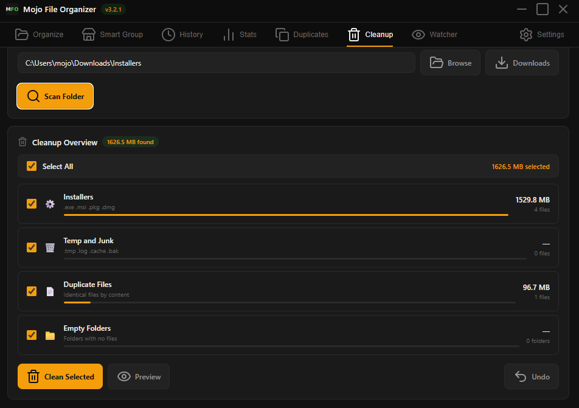

<div align="center">


# Mojo File Organizer

**A modern, elegant file organizer desktop app for Windows**

[](https://github.com/mojouto3/mojo-file-organizer/releases)
[](https://github.com/mojouto3/mojo-file-organizer/releases)
[](https://electronjs.org)
[](LICENSE)
[](https://github.com/mojouto3)

[Download](#installation) · [Features](#features) · [Usage](#usage) · [Build from Source](#building-from-source)

---

)

</div>

---

## What is Mojo File Organizer?

Mojo File Organizer is a free, open-source Windows desktop application that automatically sorts any folder into clean, organized subfolders with a single click.

Unlike basic file sorters, Mojo File Organizer gives you full control: customize your own categories, define which file extensions belong where, group files by client or store name, find and remove duplicates, clean up wasted disk space, monitor folders in real-time, and track statistics over time. All wrapped in a clean, modern interface with dark and light themes.

---

## Features

### Core
- One-click organize ➔ select any folder and sort all files instantly
- Smart Preview ➔ see exactly what will move and where, before committing
- Undo ➔ instantly restore all moved files back to their original location
- Progress bar ➔ real-time feedback showing which file is being moved

### Smart Group
- Group by store or client name ➔ files matched by name regardless of separators or case
- Persistent groups ➔ add your stores/clients once, remembered forever
- Unlimited groups ➔ add as many as you need

### Duplicate Finder
- Scan by content ➔ MD5 hash comparison finds identical files regardless of name
- Scan by name ➔ finds files with the same filename
- Visual indicators ➔ KEEP and DELETE badges for clear decision making
- Undo ➔ restore deleted files instantly

### Cleanup Tab
- Scan any folder for wasted disk space
- Select All checkbox with total size calculation
- Four sections: Installers, Temp and Junk, Duplicate Files, Empty Folders
- Progress bar per section showing relative size
- Preview before deletion
- Undo support ➔ restore cleaned files instantly

### File Watcher
- Real-time monitoring ➔ watches a folder and auto-organizes new files as they arrive
- Activity log ➔ see every file organized with timestamp and destination
- Windows notifications ➔ get notified when files are auto-organized

### History and Stats
- Session history ➔ every organize session saved with date, time, folder and file details
- Statistics dashboard ➔ total files, sessions count, breakdown by category with chart
- Export to CSV ➔ full session history as spreadsheet
- Export to PDF ➔ professional statistics report with branding

### Appearance and Languages
- Dark and Light themes switchable in real time
- Eight preset accent colors plus custom color picker
- Five languages: English, Greek, German, Spanish, Russian

### Settings and Customization
- Custom categories and extensions
- Enable/disable categories
- Default folder on startup
- Start with Windows
- Minimize to Tray
- Auto-schedule with custom days and time
- Tray Quick Actions ➔ organize without opening the app

---

## File Categories (Default)

| Category | File Types |
|---|---|
| Images | jpg, jpeg, png, gif, bmp, webp, svg, ico, tiff, heic, raw, avif |
| Videos | mp4, mkv, avi, mov, wmv, flv, webm, m4v, mpg, mpeg |
| Audio | mp3, wav, flac, aac, ogg, m4a, wma, opus, aiff |
| Documents | pdf, doc, docx, xls, xlsx, ppt, pptx, odt, txt, rtf, epub, mobi |
| Archives | zip, rar, 7z, tar, gz, bz2, xz, iso, dmg, cab |
| Code | py, js, ts, html, css, json, xml, yaml, sh, bat, ps1, java, cpp, cs, go, php, sql, md |
| Installers | exe, msi, msix, appx, apk, deb, rpm, pkg |
| Fonts | ttf, otf, woff, woff2, eot |
| Torrents | torrent |

All categories can be customized, enabled/disabled, or deleted from the Settings tab.

---

## Installation

### Option 1 - Installer (Recommended)

1. Go to the [Releases](../../releases) page
2. Download the latest **`Mojo File Organizer Setup X.X.X.exe`**
3. Run the installer and follow the steps
4. A Mojo File Organizer shortcut will appear on your Desktop

### Option 2 - Portable

Coming soon.

---

## Usage

### Organize Tab
1. Click Downloads to auto-detect your Downloads folder, or Browse to choose any folder
2. Review the Preview ➔ files grouped by category with counts
3. Click Organize Now
4. Use Undo to reverse if needed

### Smart Group Tab
1. Add your store or client names (e.g. Nike, store1, ClientABC)
2. Select a folder
3. Preview which files match which group
4. Click Organize Now

### Cleanup Tab
1. Select a folder
2. Click Scan Folder
3. Review the sections ➔ see how much space each category takes
4. Check or uncheck what you want to remove
5. Click Preview to see exactly what will be deleted
6. Click Clean Selected to remove
7. Use Undo to restore if needed

### Duplicates Tab
1. Select a folder
2. Click Scan by Content or Scan by Name
3. Review duplicates ➔ first file is marked KEEP, others as DELETE
4. Select files to delete and click Delete Selected

### Watcher Tab
1. Select a folder to monitor
2. Click Start Watching
3. New files are automatically organized as they arrive

### Stats Tab
- View total files organized and breakdown by category
- Export to CSV or PDF with one click

### Settings Tab
- Appearance: switch Dark/Light theme and accent color
- Language: EN, GR, DE, ES, RU
- Default Folder, Start with Windows, Minimize to Tray
- Auto-Schedule: choose days and time
- Categories: customize extensions or create new ones

### Tray Quick Actions
Right-click the tray icon to organize without opening the app.

---

## Building from Source

### Requirements
- [Node.js](https://nodejs.org) v18 or later
- npm (included with Node.js)
- Windows

### Run in development

```bash
git clone https://github.com/mojouto3/mojo-file-organizer.git
cd mojo-file-organizer
npm install
npm start
```

### Build installer

Open PowerShell as Administrator:

```bash
npm run build
```

---

## Project Structure

```
mojo-file-organizer/
├── assets/icon.ico       # MFO app icon
├── main.js               # Electron main process
├── preload.js            # Secure bridge between main and renderer
├── renderer.js           # UI logic
├── index.html            # App layout and tabs
├── style.css             # Dark/light themes and components
├── translations.js       # UI strings for EN, GR, DE, ES, RU
└── package.json          # Config and build settings
```

---

## Changelog

See [CHANGELOG.md](CHANGELOG.md) for full version history.

---

## Roadmap

- [ ] Portable version (no installer needed)
- [ ] Folder size treemap visualization
- [ ] Cloud backup integration

---

## Related Projects

- [downloads-organizer](https://github.com/mojouto3/downloads-organizer) ➔ Ultra-lightweight PowerShell version
- [downloads-organizer-v2](https://github.com/mojouto3/downloads-organizer-v2) ➔ Electron lite edition, Downloads folder only

---

## Contributing

Pull requests are welcome! See [CONTRIBUTING.md](CONTRIBUTING.md) for guidelines.

---

## License

MIT License ➔ free to use, modify, and share. See [LICENSE](LICENSE) for details.

---

<div align="center">

Made with ☕ by [mojomultimedia](https://github.com/mojouto3) · [Constantinos-T](https://github.com/Constantinos-T)

</div>
